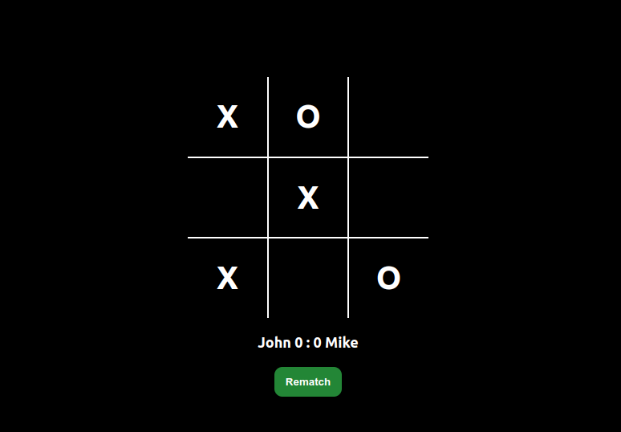

# Tic Tac Toe

## Preview

## Description
* A simple tic tac toe browser game.

## Made with
* HTML, CSS and JavaScript.

## Visit website
* [Link](https://jovan-nsty.github.io/tic-tac-toe/)

## Purpose
* The purpose of this project was to focus on using the Factory function design and the Module pattern design as the building blocks of the project.

* This project was done following The Odin Project curriculum.